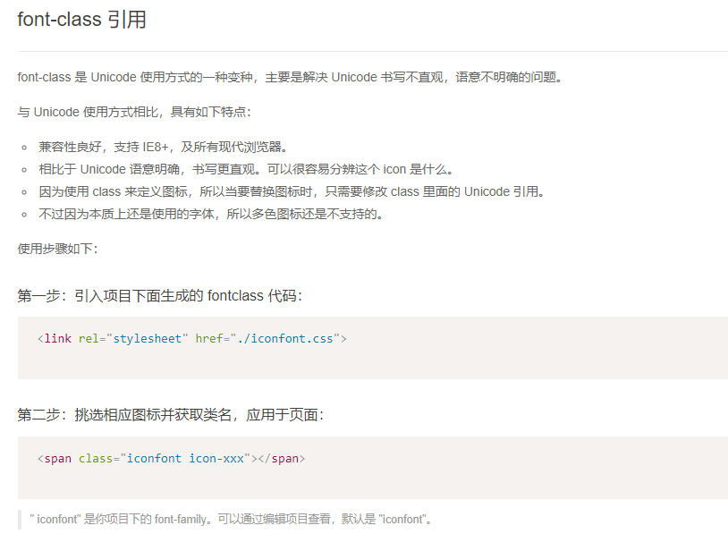

# css基础
## css书写位置
- 外部引入
`<link rel="stylesheet" href="header.css">`
- 内部书写
写在`head`标签内部 ,用`style`标签包裹
- 行内样式
属性名:属性值; 属性名:属性值; 
   外部样式 用的最多 可以复用
   行内样式 少用 样式结构 严重耦合    能复用
   内部样式 平常演示代码时 经常用    能复用

```html
ul {
             去掉 列表的 项目符号(前边的小圆点) 
            list-style: none;
    }
*{
    margin:0
    padding:0
}
```

    

## css选择器
- `*p` 选中所有的`p`标签
- `*`(通配符) 选中所有标签
设置样式    选中这个标签   设置 样式属性 即可 -->
id  唯一标识 (身份证)
class  类名 (给标签分类)
- `class`选择器 (类名选择器)
  用的最多,可以重复
- `id`选择器
  不重复 

## 复杂选择器
- 后代选择器  父类加空格
- 交集选择器  不加空格
- 并集选择器  用`,`隔开
- 子代选择器  父类类名>子类类名
- 兄弟选择器  类名+(选中下一个)


## css层叠性和权重
- 层叠 设置的所有样式共同作用的效果
- 样式冲突时    选择器权重高的  生效
- 权重大小  行内样式(1000)>id选择器(100)>class选择器(10)>标签选择器(1)>通配符
    - 复杂选择器权重  各种选择器权重累加


## 继承性

子类会继承父类样式
`a`标签不能继承父类设置的字体颜色


[css继承性](https://www.cnblogs.com/thislbq/p/5882105.html)

## css常见单位
- 像素单位 `px`
- `em` 基于当前字体的倍数
- 百分比  相对于父类的百分比
- 颜色单位 预定义 `red` `green` `blue` `贫困`
  十六进制 `#ffffff`(白色) #dd5044    rgb(221,80,68)
  rgba的a表示透明度


## css常见属性

|属性名称|属性作用|值|  
|----|---|---|
|width/heigth|宽高|px;百分比;emdeng|
|background-color|背景颜色|color|
|color|字体颜色|color|
|font-size|字体大小|px;em等|
|text-align|文字对齐方式|center;left;right|
|text-intend|首行缩进|px;em等|
|font-family|字体|中文英文都能识别|
|font-weight|字体加粗|100-900;(加粗)700-900/bolder lighter(变细); normal(正常)|
|font-style|字体样式|ltalic(西斜体);normal|
|line-height|行高|单位:px/倍数/百分比; 设置文字的行间距;单行文本垂直局中:行高=父类盒子高度|
|font|字体缩写|`font:italic border 20px/1.2 宋体|

## 标签表现形式
- 块状标签:独占一行，宽高有效。
比如:`div` `p` `h1~h6` `form    ` `table` `hr` `br` `ul>li` `ol>li` `dl>dt>dd`
- 行内块标签:可以同一行显示，宽高有效。
比如:`input` `select` `img` `button`
- 行内标签:可以同一行显示，但是宽高无效。
比如:`a` `span` `strong` `del` `ins` `em` `i` `b`
- `display`:可以修改元素(标签)的性质 
    - `block`:设置元素为块元素
    - `inline`:设置元素为行内元素
    - `inline-block`:设置元素为行内块元素
    - 转换的必要性：比如可以把`a`标签转换为块状元素，设置宽高，使用户可点击的区域增大，进而实现一个按钮的样式。

## 背景图片属性

|属性名称|属性作用|值|
|-------|-----|----|
|background-color|背景图片颜色|color|
|background-image|背景图片|url()|
|background-repeat|平铺方式|repeat(重叠);no-repeat(不平铺);repeat-x(x轴方向平铺);repeat-y(y轴方向平铺)|
|background-position|图片位置|left;right;top;bottom;center|
|background-attachment|背景滚动|scroll(滚动);fixed(固定)|
|background|简写(顺序不能错)|background:green url() no-repeat center center fixed;|

## css3新增属性

- box-shadow（阴影效果）
- border-color（为边框设置多种颜色）
- border-image（图片边框）
- text-shadow（文本阴影）
- text-overflow（文本截断） 
- word-wrap（自动换行）
- border-radius（圆角边框）
- opacity（透明度）
- box-sizing（控制盒模型的组成模式）
- resize（元素缩放）
- outline（外边框）
- background-size（指定背景图片尺寸）
- background-origin（指定背景图片从哪里开始显示）
- background-clip（指定背景图片从什么位置开始裁剪）
- background（为一个元素指定多个背景）
- hsl（通过色调、饱和度、亮度来指定颜色颜色值）
- hsla（在hsl的基础上增加透明度设置）
- rgba（基于rgb设置颜色，a设置透明度）
- 给图片加黑白滤镜
```
-webkit-filter: grayscale(100%); 
-moz-filter: grayscale(100%); 
-ms-filter: grayscale(100%); 
-o-filter: grayscale(100%); 
filter: grayscale(100%); 
filter: gray;
```


## 盒子模型
CSS 处理网页时，它认为每个元素都包含在一个不可见的盒子里。包含内容区域、padding（内边距）、border（边框）、margin（盒子与盒子的距离）。

所有的页面的元素都可以看成是一个盒子，占据一定的页面空间。


### padding
- `padding`:10px 20px 30px 40px;分别设置元素的上  右  下  左四个方向的内边距
- `padding`:10px 20px 30px;分别设置元素的上  左右  下四个方向的内边距
- `padding`:10px 20px;分别设置元素的上下  左右四个方向内边距
- `padding`:10px;同时设置四个方向的内边距
- 同时在 css 中还提供了 `padding-top`、`padding-left`、`padding-right`、`padding-bottom` 分别用来指定四个方向的内边距。
- 改变元素的大小

### margin
- 同上
- `margin: 0 auto;`可以使块状元素水平居中
- `嵌套崩塌`:两个盒子发生嵌套的时候，给子类设置 margin 会给父类造成一种崩塌现象，子类元素的 margin-top 没有效果，而是直接作用到父类元素.
- `margin重叠` :如果垂直方向上两个块状元素同时设置了 margin-bottom 和 margin-top，那么这两个值将会发生重叠，不会累加，哪个值大用哪个。
- `margin-top/margin-bottom`对于行内元素无效。

#### 解决嵌套崩塌
- 父类 `overflow: hidden;`
- 父类 设置极小的`padding`或`border`


## border
- 可以在元素周围创建边框，边框是元素可见框的最外部。
- `border:1px solid red;` 分别指定了边框的宽度、颜色和样式，是一种缩写：`border-width border-style border-color`。
- `border-style: none (默认) / dashed(虚线) / dotted（点） / solid(实线) / double(双实线)。`
- 可以单独设置某一条边框：`border-right: 20px solid blue;`
- 改变元素的大小.
- `border-radius:50%;`可以改变块状元素的圆角 50%时正方形会变成园

- `border`做三角形
```
<!DOCTYPE html>
<html lang="en">

<head>
    <meta charset="UTF-8">
    <meta name="viewport" content="width=device-width, initial-scale=1.0">
    <meta http-equiv="X-UA-Compatible" content="ie=edge">
    <title>Document</title>
    <style>
        .box {
            position: absolute;
            left: 0;
            top: -100px;
            width: 0;
            /* width: 100px;
            height: 100px; */
            background-color: red;
            /* 背景色蔓延到 padding 和 border 区域 */
            background-clip: content-box;
            border: 100px solid;
            border-color: transparent transparent blue transparent;
            border-bottom-width: 400px;
        }
    </style>
</head>

<body>
    <div class="box">

    </div>
</body>

</html>
```


## 显示和隐藏
- `display:none`: 隐藏元素，不再在文档中占据位置。
    - 显示:可以将 `display` 设置为其他属性值，不为`none` 即可。
- `visibility:hidden;`隐藏元素，隐藏后其在文档中所占的位置会依然保持，不会被其他元素覆盖。

## overflow

`overflow`  指定标签里面的内容超出了样式的宽度和高度时如何处理。
- visible:默认值
- scroll:添加滚动条
- auto:根据需要添加滚动条
- hidden:隐藏超出盒子的内容
- 超出部分打点  
    - 宽度有限
    - 不能换行
    - 超出打点
    - 超出部分隐藏
```
p {
             width: 100px;
            background-color: green;
            overflow: hidden;
            text-overflow: ellipsis;
            white-space: nowrap;
        }
```

## 文档流
- 块状元素独占一行
- 行内元素可以同一行显示,自左向右,如果不够会自动换行
- 自上而下的展示
- 脱离文档流:浮动和定位

## 浮动

> 浮动指的是使元素脱离原来的文本流，在父元素中浮动起来。
- 浮动使用`float`属性
- 可选值:
    - none:不浮动
    - left:左浮动
    - right:右浮动
- 当一个元素浮动以后,下方的元素会上移,元素中的neirong将会围绕在元素的周围

- 自适应:当一侧浮动时 另一侧会自适应宽度

- 当一个元素浮动以后，其下方的元素会上移。元素中的内容将会围绕在元素的周围。
- 浮动会使元素完全脱离文本流，也就是不再在文档中在占用位置。
- 元素设置浮动以后，会一直向上漂浮直到遇到父元素的边界或者其他浮动元素。
- 元素浮动以后即完全脱离文档流，这时不会再影响父元素的高度。也就是浮动元素不会撑开父元素。
- 浮动元素默认会变为块元素，即使设置 display:inline 以后其依然是个块元素。
- 块级元素和行内元素都可以浮动，当一个行内元素浮动以后将会自动变为一个块级元素。
- 当一个块级元素浮动以后，宽度会默认被内容撑开，所以当漂浮一个块级元素时我们都会为其指定一个宽度。

### 清除浮动带来的影响

- 严格计算父类盒子的高度
- `clear: left/right/both` 不允许当前元素的 `left/right/both`有浮动元素。
    - 在浮动元素的最后面追加一个空的 `div`,设置 `clear:both` 即可清除浮动的影响。

*补充:
- display:inline-block 标签的换行符会被显示为空格
- float:right 会改变标签的前后顺序


##  定位

>通过 `position` 属性可以实现元素的定位。元素定位之后，需要通过设置 `left/right 和 top/bottom`值对元素定位。
- `position`属性可以把一个元素放置到网页的任何位置
- 可选值:
    - static  默认
    - relative
    - absolute
    - fixed
    - sticky


### `relative` 相对定位
相对元素本身的位置定位。
- 每个元素在页面的文档流中都有一个自然位置。相对于这个位置对元素进行移动就称为相对定位。周围的元素完全不受此影响。
- 当开启了相对定位以后，可以使用 top、right、bottom、left 四个属性对元素进行定位。
- 如果不设置元素的偏移量，元素位置不会发生改变。
- 相对定位不会使元素脱离文本流。元素在文本流中的位置不会改变。
- 相对定位不会改变元素原来的特性。
- 相对定位会使元素的层级提升，使元素可以覆盖文本流中的元素。


### `absolute` 绝对定位
指使元素相对于视口或离他最近的祖先定位元素进行定位。

- 当开启了绝对定位以后，可以使用 top、right、bottom、left 四个属性对元素进行定位。
- 绝对定位会使元素完全脱离文本流。
- 绝对定位的块元素的宽度会被其内容撑开。
- 绝对定位会使行内元素变成块元素。
- 一般使用绝对定位时会同时为其父元素指定一个相对定位，以确保元素可以相对于父元素进行定位。


### `fixed` 固定定位
元素会被锁定在屏幕的某个位置上，当访问者滚动网页时，固定元素会在屏幕上保持不动。 (相对于视口定位)

- 固定定位不占据原来的位置，会脱离文档流。
- 给元素设置固定定位之后，元素位置从浏览器左上角出发。 - 可以将行内元素转换块元素。


### `sticky` 粘性定位
粘性定位可以被认为是相对定位和固定定位的混合。元素在跨越特定阈值前为相对定位，之后为固定定位


## z-index(定位元素使用)
- 当元素开启定位以后就可以设置 z-index 这个属性。默认是 0。
- z-index 可以指定一个整数作为参数，值越大元素显示的优先级越高，也就是 z-index 值较大的元素会显示在网页的最上层。


## css兼容问题
```
  <!--[if gte IE 7]> <link rel="stylesheet" href="ie10.css"> <![endif]-->(大于ie7版本)
  <!--[if lte IE 8]> <script src="html5shiv.min.js"></script> <![endif]-->(小于ie8版本)
```


注意: 在非IE浏览器中是看不到效果的

- lte：就是Less than or equal to的简写，也就是小于或等于的意思。
- lt ：就是Less than的简写，也就是小于的意思。
- gte：就是Greater than or equal to的简写，也就是大于或等于的意思。
- gt ：就是Greater than的简写，也就是大于的意思。
- !： 就是不等于的意思，跟javascript里的不等于判断符相同


### 面试题: 什么是web标签语义化

- 标签语义化的目的在于能够直观的认识标签和属性的用途和作用，好处：

- 1、使页面的内容结构化：结构更清晰，便于不同的屏幕设备解析；

- 2、有利于SEO：和搜索引擎建立良好的关系，有助于爬虫更多的有效信息；

- 3、便于团队开发和维护；

## 自体图标

